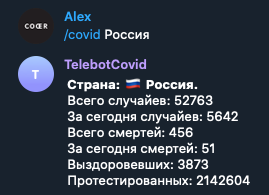
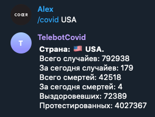

# TelebotCovid
> Telegram bot to give updates about COVID-19 (Novel Coronavirus).

### Usage example
--------------------
* Clone project
* Install your access token
* run python bot.py
* Add bot @CovidTeleBot
* /covid <country_name>

### Commands
--------------------
* /help - print all commands
* /covid - print coronavirus cases worldwide
* /covid <country_name> - print coronavirus cases in country